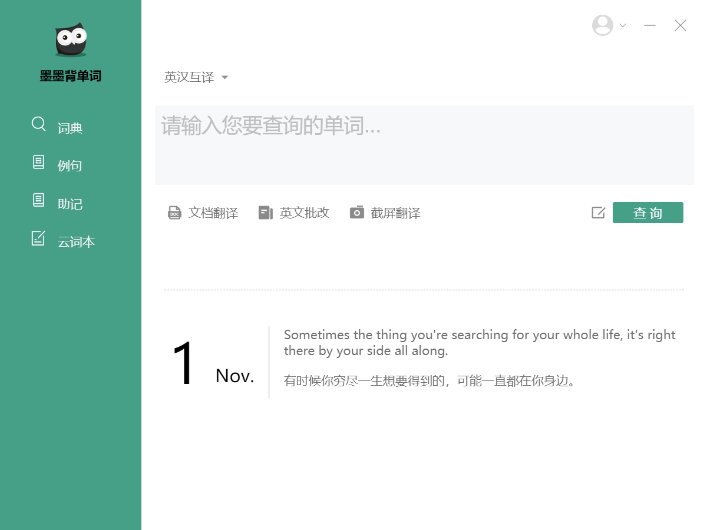

参考 [网易有道词典](http://cidian.youdao.com/) 的桌面应用 UI 设计，使用 electron 制作了一个 [墨墨背单词](https://www.maimemo.com/) 的桌面应用 UI。



- 图标来源：
  - https://www.iconfont.cn/collections/detail?spm=a313x.7781069.1998910419.d9df05512&cid=16472

---

运行：
```
npm install
npm run watch
```
